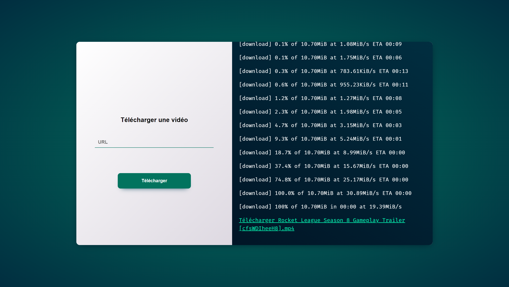

# YT-DLP Web

> 🟡 **Project status**: Maintenance mode

## Link
You can use the tool [[here]](https://labaguettedev.live/dl)

## FR
**YT-DLP Web** est une application web développée en PHP qui permet de télécharger une vidéo de la plupart des hébergeurs de vidéos.
[[Liste des sites web supportés par YT-DLP]](https://github.com/yt-dlp/yt-dlp/blob/master/supportedsites.md)

## EN
**YT-DLP Web** is a web application developed in PHP that allows you to download a video from most video hosts.
[[List of websites supported by YT-DLP]](https://github.com/yt-dlp/yt-dlp/blob/master/supportedsites.md)

## Screenshot
